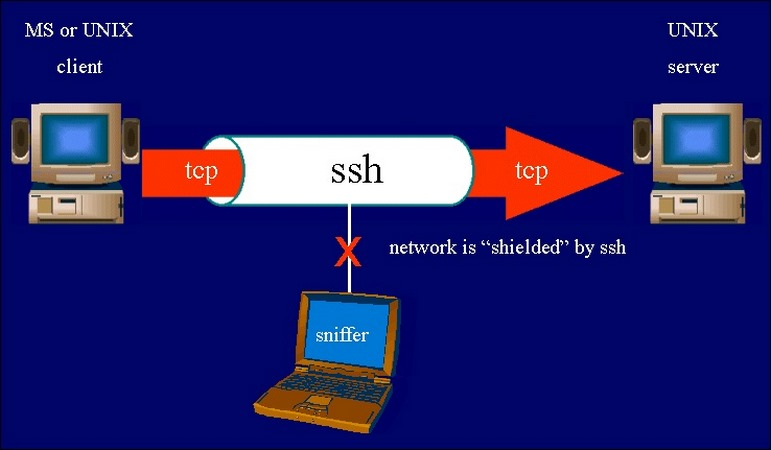

# 1.SSH là gì 
## 1.1 Khái niệm
SSH là một giao thức đăng nhập vào hệ thống server từ xa, sử dụng cơ chế mã hóa đủ mạnh nhằm ngăn chặn các hiện tượng nghe trộm, đánh cắp thông tin trên đường truyền. SSH cho người dùng khả năng kiểm soát, quản trị dữ liệu của server thông qua internet. SSH chính là từ viết tắt của cụm từ Secure Socket Shell. SSH giúp cho việc kết nối của mạng lưới máy chủ với máy khách được đảm bảo an toàn và bảo mật tốt.

## 1.2 Cơ chế hoạt động 
SSH bao gồm có giao thức mạng và bộ tiện ích cơ bản để triển khai giao thức đó. SSH ứng dụng ảnh mô hình là client-server để kết nối với vùng hiển thị Session và vùng Session chạy.
Khi chạy giao thức SSH, hệ thống sẽ hỗ trợ cả giao thức ứng dụng và sẽ sử dụng cho trình giả lập Terminal hoặc truyền file. Trên thực tế, người ta còn sử dụng SSH để phát triển nên tunnel bảo mật cho giao thức của ứng dụng.

SSH làm việc thông qua 3 bước
- **Định danh Host - xác định định danh của hệ thống tham gia phiên làm việc SSH**

    Việc định danh host được thực hiện qua việc trao đổi khoá. Mỗi máy tính có hỗ trợ kiểu truyền thông SSH có một khoá định danh duy nhất. Khoá này gồm hai thành phần: khoá riêng và khoá công cộng. Khoá công cộng được sử dụng khi cần trao đổi giữa các máy chủ với nhau trong phiên làm việc SSH, dữ liệu sẽ được mã hoá bằng khoá riêng và chỉ có thể giải mã bằng khoá công khai. Khi có sự thay đổi về cấu hình trên máy chủ: thay đổi chương trình SSH, thay đổi cơ bản trong hệ điều hành, khoá định danh cũng sẽ thay đổi. Khi đó mọi người sử dụng SSH để đăng nhập vào máy chủ này đều được cảnh báo về sự thay đổi này. Khi hai hệ thống bắt đầu một phiên làm việc SSH, máy chủ sẽ gửi khoá công cộng của nó cho máy khách. Máy khách sinh ra một khoá phiên ngẫu nhiên và mã hoá khoá này bằng khoá công cộng của máy chủ, sau đó gửi lại cho máy chủ. Máy chủ sẽ giải mã khoá phiên này bằng khoá riêng của mình và nhận được khoá phiên. Khoá phiên này sẽ là khoá sử dụng để trao đổi dữ liệu giữa hai máy. Quá trình này được xem như các bước nhận diện máy chủ và máy khách.  

- **Mã hóa - thiết lập kênh làm việc mã hóa**
Sau khi hoàn tất việc thiết lập phiên làm việc bảo mật (trao đổi khoá, định danh), quá trình trao đổi dữ liệu diễn ra thông qua một bước trung gian đó là mã hoá/giải mã. Điều đó có nghĩa là dữ liệu gửi/nhận trên đường truyền đều được mã hoá và giải mã theo cơ chế đã thoả thuận trước giữa máy chủ và máy khách. Việc lựa chọn cơ chế mã hoá thường do máy khách quyết định. Các cơ chế mã hoá thường được chọn bao gồm: 3DES, IDEA, và Blowfish. Khi cơ chế mã hoá được lựa chọn, máy chủ và máy khách trao đổi khoá mã hoá cho nhau. Việc trao đổi này cũng được bảo mật dựa trên đinh danh bí mật của các máy. Kẻ tấn công khó có thể nghe trộm thông tin trao đổi trên đường truyền vì không biết được khoá mã hoá. Các thuật toán mã hoá khác nhau và các ưu, nhược điểm của từng loại:

    - 3DES (cũng được biết như Triple-DES) -- phương pháp mã hoá mặc định cho SSH.
    - IDEA—Nhanh hơn 3DES, nhưng chậm hơn Arcfour và Blowfish.
    - Arcfour—Nhanh, nhưng các vấn đề bảo mật đã được phát hiện.
    - Blowfish—Nhanh và bảo mật, nhưng các phương pháp mã hoá đang được cải tiến.

- **Chứng thực - xác thực người sử dụng có quyền đăng nhập hệ thống** 

    Việc chứng thực là bước cuối cùng trong ba bước, và là bước đa dạng nhất. Tại thời điểm này, kênh trao đổi bản thân nó đã được bảo mật. Mỗi định danh và truy nhập của người sử dụng có thể được cung cấp theo rất nhiều cách khác nhau. Chẳng hạn, kiểu chứng thực rhosts có thể được sử dụng, nhưng không phải là mặc định; nó đơn giản chỉ kiểm tra định danh của máy khách được liệt kê trong file rhost (theo DNS và địa chỉ IP). Việc chứng thực mật khẩu là một cách rất thông dụng để định danh người sử dụng, nhưng ngoài ra cũng có các cách khác: chứng thực RSA, sử dụng ssh-keygen và ssh-agent để chứng thực các cặp khoá.

## 1.3 Chức năng của SSH
SSH có thể được sử dụng cho nhiều mục đích khác nhau, bao gồm:

- Quản trị máy tính từ xa: SSH cho phép quản trị viên hệ thống quản lý máy tính từ xa một cách an toàn.
- Truyền tệp: SSH có thể được sử dụng để truyền tệp an toàn giữa hai máy tính.
- Truy cập vào máy chủ từ xa: SSH có thể được sử dụng để truy cập vào máy chủ từ xa, chẳng hạn như máy chủ web hoặc máy chủ ứng dụng.
- Xác thực: SSH sử dụng xác thực hai yếu tố để xác thực người dùng. Điều này giúp ngăn chặn truy cập trái phép vào máy tính từ xa.
- Mã hóa: SSH sử dụng thuật toán mã hóa để bảo vệ dữ liệu trao đổi giữa hai máy tính. Điều này giúp ngăn chặn kẻ tấn công nghe trộm hoặc thay đổi dữ liệu.
- Khả năng kiểm soát truy cập: SSH cung cấp các tính năng kiểm soát truy cập để ngăn chặn truy cập trái phép vào máy tính từ xa.

# 2. Kỹ thuật mã hóa trong SSH

## 2.1. Mã hóa Symmetric Encryption
Symmetric Encryption chính là một phương thức mã hóa ứng dụng Secret Key theo hai chiều, giải mã tin cho Host và Client. Như vậy, bất kỳ ai sở hữu mã khóa đều có khả năng giải mã tin nhắn trong quá trình truyền tin.

Symmetric Key được ứng dụng để mã hóa hoàn toàn phiên giao dịch diễn ra trong giao thức SSH. Trong đó, Host và Client có nhiệm vụ tạo Key bí mật, tuyệt đối không để lộ cho bên thứ ba.

Chính bởi Key không truyền tải giữa Client và Host nên thuật toán rất bảo mật. Cả hai máy tính có thể chia sẻ thông tin chung, ứng dụng chúng xác định mã Key bí mật. Bất kỳ máy tính khác có thể nắm bắt thông tin hay không, chúng cũng không dò được mã khóa bí mật.

Tuy nhiên cũng cần lưu ý rằng, Secret Token chỉ có thời hạn sử dụng trong một phiên SSH, nó hình thành từ chứng thực Client. Khi tạo mới Key, toàn bộ Packets giữa hai máy cần trải qua mã hóa bởi Private Key. Quá trình này gồm cả bước cung cấp mật khẩu bởi người dùng.

## 2.2.Mã hóa Asymmetric Encryption
Khác với Symmetric Encryption, phương thức Asymmetric Encryption lại dùng 2 khóa riêng biệt để phục vụ mã hóa và giải mã. Bao gồm khóa công khai Public Key và khóa riêng tư Private Key, hình thành cặp khóa Public-private key pair.

Khóa Public Key công khai trên tất cả các thành phần liên quan. Tuy nhiên, nó cũng liên hệ trực tiếp với khóa riêng tư Private Key. Chính sự phụ thuộc này nên Public Key gần như không thể tự mã hóa thư, giải mã bất cứ thứ gì đã mã hóa bởi Private Key.

Trong khi đó Private Key lại luôn tuyệt mật, không chia sẻ với bất kỳ bên thứ ba nào. Khóa riêng tư có khả năng giải mã thư. Vậy nên khi bên nào giải thành công thư gửi đến Public Key có nghĩa bên thứ đó đang sở hữu Private Key.

Vậy nhưng cũng cần lưu ý rằng Asymmetric Encryption không thể mã hóa tất cả SSH. Nó chỉ có thể sử dụng khi trao đổi thuật toán khóa. Trước thời điểm bắt đầu một phiên, phía 2 đầu trao đổi cần đồng ý khởi tạo cặp khóa Public - Private trong ngắn hạn. Đồng thời, chia sẻ Private Key để tạo ra một Secret Key chung.

Mỗi khi liên kết Symmetric chính thức thiết lập an toàn, máy chủ Server cũng đồng thời sử dụng Public Key của Client. Từ đó khởi tạo, thay đổi và truyền đến Client phục vụ quá trình chứng thực. Trường hợp Client giải thành công tin nhắn có nghĩa nó đang giữ Private Key. Phiên giao dịch SSH cũng đồng thời bắt đầu.

## 2.3. Mã hóa Hashing

Hashing một chiều là phương thức mã hóa ứng dụng phổ biến trong Secure Shell Connection. Khác với Symmetric Encryption và Asymmetric Encryption, Hashing không sử dụng vào mục đích giải mã. Chúng hình thành sau mỗi lần nhập liệu, không thể khai thác. Như vậy, Hashing sẽ không thể quay lại để giải mã.

Thông thường, để tạo ra một mật mã Hash rất đơn giản qua một lần Input. Thế nhưng chúng ta lại không thể tạo ra Input thông qua chính lần Hash đó. Nói cách khác, Client đang giữ Input đó. Điều này có nghĩa chỉ Client có thể tạo một crypto-graphic hash để tiến hành xác định hai bên nhập Input.

Giao thức SSH cần đến Hash để kiểm tra tính xác thực của tin nhắn. Quy trình xác thực này đảm bảo rằng lệnh không thể giả danh bởi bất cứ phương thức nào.

# 3.Tìm hiểu các tùy chọn cơ bản của file cấu hình SSH
Dưới đây là một số tùy chọn cơ bản của file cấu hình SSH:

- Phiên bản: Tùy chọn này xác định phiên bản SSH được sử dụng bởi máy chủ.
- Cổng: Tùy chọn này xác định cổng mà máy chủ SSH lắng nghe.
- Mã hóa: Tùy chọn này xác định thuật toán mã hóa được sử dụng để bảo vệ dữ liệu trao đổi giữa hai máy tính.
- Xác thực: Tùy chọn này xác định phương pháp xác thực được sử dụng bởi máy chủ SSH.
- Quản lý phiên: Tùy chọn này xác định các cài đặt quản lý phiên được sử dụng bởi máy chủ SSH.
- Truy cập từ xa: Tùy chọn này xác định các cài đặt truy cập từ xa được sử dụng bởi máy chủ SSH.
Các tùy chọn cơ bản của file cấu hình SSH

|Tùy chọn|Mô tả|
|-------|-----|
|Protocol|Xác định phiên bản SSH được sử dụng bởi máy chủ |
|Port|Xác định cổng máy chủ SSH lắng nghe|
|Cyphers|Xác định thuật toán mã hóa được sử dụng để bảo vệ dữ liệu trao đổi giữa hai máy tính .Giá trị mặc định là *aes128-ctr* ,*aes192-ctr*, *aes256-ctr*|
|AuthMethods|Xác định phương pháp xác định được sử dụng bởi máy chủ SSH. Giá trị mặc định là *publickey,password*|
|MaxSessions|Xác định số phiên SSH tối đa mà một người dùng có thể mở cùng lúc |
|MaxAuthTries|Xác định số lần xác thực tối đa một người dùng có thể thực hiện trước khi bị khóa |
|PermitRootLogin|Xác định liệu người dùng Root có được phép đăng nhập qua SSH hay không |
|AllowUsers|Xác định danh sách người dùng được phép đăng nhập qua SSH.Giá trị mặc định là trống |
|DenyUsers|Xác định danh sách người dùng bị cấm đăng nhập qua SSH. Giá trị mặc định là trống |
|PermitOpen|Xác định các cổng hoặc dịch vụ mà người dùng được phép truy cập qua SSH. Giá trị mặc định là trống|
|DenyOpen|Xác định các cổng hoặc dịch vụ mà người dùng bị cấm truy cập qua SSH. Giá trị mặc định là trống|

Thay đổi file cấu hình SSH để tăng cường bảo mật

Dưới đây là một số thay đổi mà bạn có thể thực hiện đối với file cấu hình SSH để tăng cường bảo mật:
- Chỉ sử dụng giao thức SSH phiên bản 2. Giao thức SSH phiên bản 1 đã lỗi thời và chứa nhiều lỗ hổng bảo mật.
- Sử dụng thuật toán mã hóa mạnh. Bạn nên sử dụng thuật toán mã hóa mạnh như AES-256.
- Bật xác thực hai yếu tố. Xác thực hai yếu tố thêm một lớp bảo mật bổ sung bằng cách yêu cầu người dùng nhập mã từ thiết bị di động của họ.
- Cấm đăng nhập bằng mật khẩu. Bạn nên chỉ cho phép người dùng đăng nhập bằng khóa SSH.
- Giới hạn số phiên SSH tối đa. Điều này sẽ giúp ngăn chặn các cuộc tấn công từ chối dịch vụ.
- Giới hạn số lần xác thực tối đa. Điều này sẽ giúp ngăn chặn các cuộc tấn công brute-force.
- Cấm đăng nhập bằng tài khoản root qua SSH. Bạn chỉ nên sử dụng tài khoản root cho các tác vụ quản trị hệ thống.
- Cho phép chỉ những người dùng cụ thể đăng nhập. Bạn nên liệt kê các người dùng được phép đăng nhập trong 

*Tài liệu tham khảo*

[1] [https://fptcloud.com/ssh-la-gi/](https://fptcloud.com/ssh-la-gi/)
[2] [https://vi.wikipedia.org/wiki/SSH](https://vi.wikipedia.org/wiki/SSH)