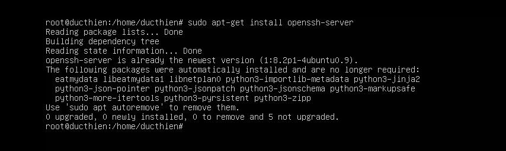
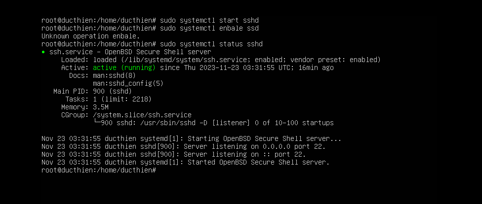
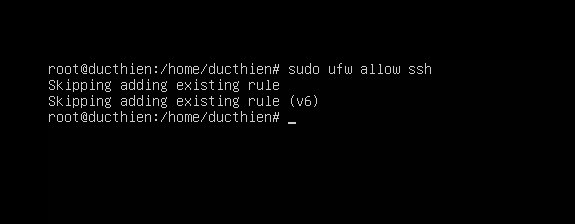
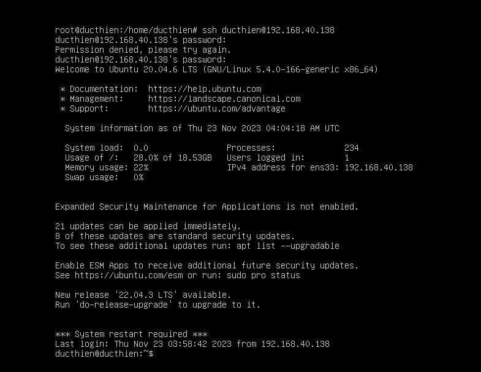
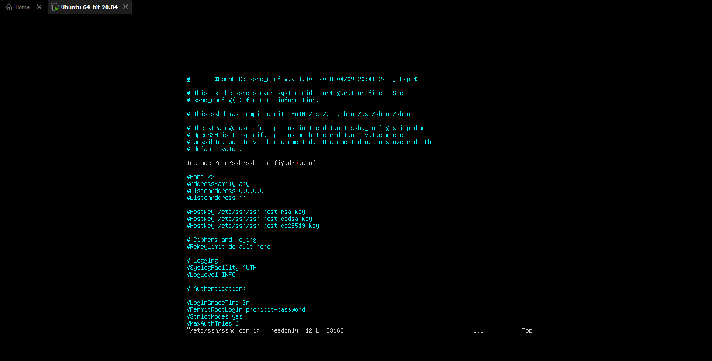
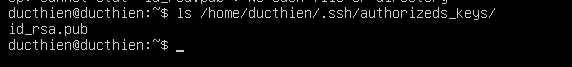
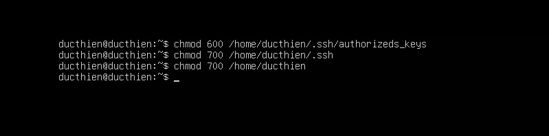
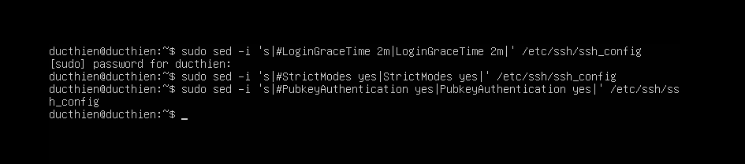
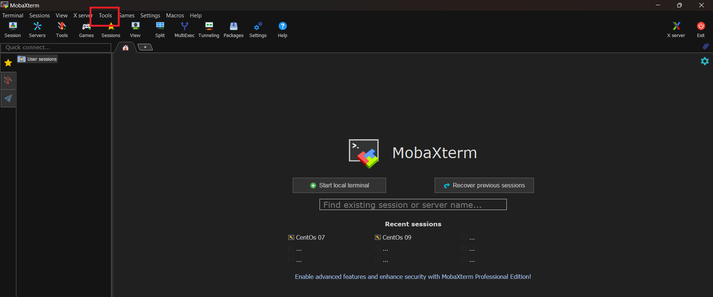
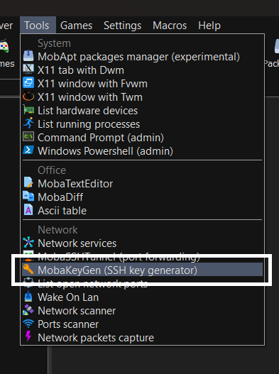

# Điều khiển từ xa với kết nối SSH
## 1.Cài đặt SSH server bằng password 

*Cấu hình mạng đảm bảo Ubuntu kết nối được internet*

- Cập nhật lại HDH trước khi cài đặt 

`sudo apt-get update`
`sudo apt-get upgrade`

Sau khi cập nhật lại HDH ta cài đặt SSH

- Cài đặt OpenSSH

`sudo apt-get install openssh-server`

-Kiểm tra xem SSH có đang hoạt động hay chưa

`sudo systemctl status sshd`

- Cấp phép tường lửa đối với SSH

`sudo ufw allow ssh`

# 2. Cài đặt SSH server bằng keypair

Mở file cấu hình SSH và kiểm tra bằng lệnh 
`ssh ducthien@192.168.40.138`

Tìm đến dòng Pubkey Authentication kiểm tra đã `yes` chưa
File lưu Pubkey là : `.ssh/authorized_keys` , `.ssh/authorized_keys2`

- Tạo 1 cặp SSH key

`ssh-keygen -t rsa`

Đầu tiên nó hỏi nhập thư mục sẽ lưu key sinh ra, hãy nhập thư mục - tên file muốn lưu hoặc nhấn Enter để sử dụng đường dẫn nó gợi ý (~/.ssh/id_rsa, ví dụ trên máy tôi /Users/ducthien/.ssh/id_rsa). Sau đó nó yêu cầu nhập passphase, nhấn Enter để rỗng. Cuối cùng nó sinh ra hai file key có tên id_rsa và id_rsa.pub ở thư mục đã nhập trên.

Coppy file publickey sang 1 thư mục khác bằng câu lệnh 
`cp /home/ducthien/.ssh/id_rsa.pub /home/ducthien/.ssh/authorizeds_keys`

Kiểm tra lại đã cp được chưa 

**Phân quyền cho các file và thư mục chứa keys.**

|Câu lệnh|x|
|---|---|
|/home/abc|700|
|/home/abc/.ssh|700|
|/home/abc/.ssh/authorized_keys |700|

**Chỉnh sửa file cấu hình**
Chạy các lệnh sau đối với file /etc/ssh/sshd_config để khai báo thư mục đặt key.

`sudo sed -i 's|#LoginGraceTime 2m|LoginGraceTime 2m|' /etc/ssh/sshd_config`
`sudo sed -i 's|#StrictModes yes|StrictModes yes|' /etc/ssh/sshd_config`
`sudo sed -i 's|#PubkeyAuthentication yes|PubkeyAuthentication yes|' /etc/ssh/sshd_config`

***Thực hiện phía Client***

**Load key với MobaXterm**

Trên MobaXterm, click vào tab Tools

Trong các sub tab của Tools, kích chọn MobaKeyGen

*Tài liệu tham khảo*

[1] [https://cloud.z.com/vn/news/ssh/](https://cloud.z.com/vn/news/ssh/)
[2] [https://wiki.matbao.net/ssh-la-gi-cach-dung-ssh-trao-doi-du-lieu-voi-server-linux/](https://wiki.matbao.net/ssh-la-gi-cach-dung-ssh-trao-doi-du-lieu-voi-server-linux/)