# CẤU HÌNH FTP Server TRÊN CentOS-7 VỚI VSFTPD
VSFTPD(Very Secure File Transport Protocol Daemon) là một FTP Server Stand Alone được phân phối bởi Red Hat Enterprise Linux .
Đây là phần mềm để tạo FTP Server với tốc độ nhanh, cấu hình đơn giản.

# 1.Cài đặt FTP Server
## 1.1.Cài đặt VSFTPD

Cài đặt gói `Vsftpd`:

```
# yum install vsftpd
```

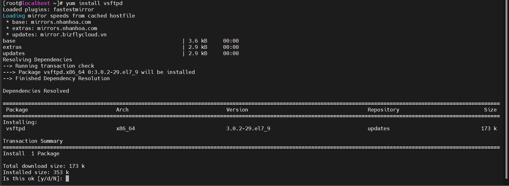

Chọn `y` để tiếp tục 

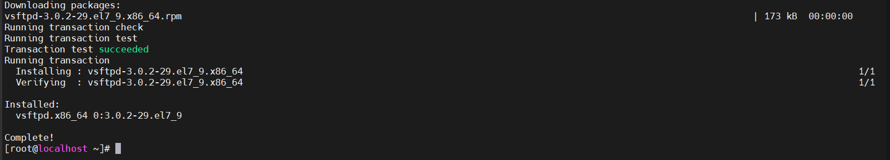

Sau khi quá trình cài đặt hoàn tất, ta khởi động dịch vụ và cho phép nó khởi động cùng hệ thống.

```
# systemctl start vsftpd
# systemctl enable vsftpd
```

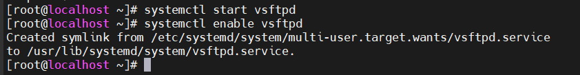

Cấu hình tường lửa cho dịch vụ FTP và port 21:

```
# firewall-cmd --permanent --add-port=21/tcp
success

# firewall-cmd --permanent --add-service=ftp
success

# firewall-cmd --reload
success

```
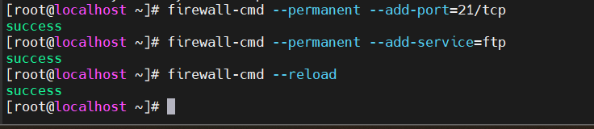

Kiểm tra trạng thái dịch vụ `vsftpd`:

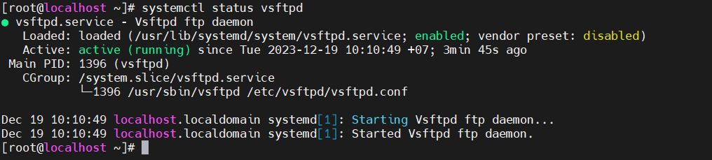

## 1.2.Cấu hình VSFTPD

File cấu hình vsftpd nằm tại : `/etc/vsftpd/vsftpd.conf`
Copy file cấu hình để backup.

```
# cp /etc/vsftpd/vsftpd.conf /etc/vsftpd/vsftpd.conf.backup
```

Chỉnh sửa file cấu hình `vsftpd.conf`:

```
# vi /etc/vsftpd/vsftpd.conf
```

- **FTP Access**: Ta không cho kết nối nặc danh, mà chỉ cho kết nối cục bộ vào FTP server

```
anonymous_enable=NO    // Không cho kết nối nặc danh 
local_enable=YES        // Cho phép kết nối cục bộ
```

- **Enabling uploads**: Cho phép người dùng upload.

```
write_enable=YES        //Cho phép người dùng nội bộ tải lên
```

- **Chroot**: kỹ thuật giữ người dùng trong thư mục của họ, không cho phép. Tại đây ta sẽ chroot tất cả user, ngoại trừ các user trong file /etc/vsftpd/chroot_list


```
chroot_local_user=YES
allow_writeable_chroot=YES
chroot_list_enable=YES
chroot_list_file=/etc/vsftpd/chroot_list

```
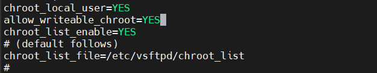

- **Login banner FTP server**: banner khi người dùng login vào FTP server.


```
ftpd_banner="Welcome FTP Server"
```


- **Giới hạn cổng kết nối cho FTP thụ động**: Giới hạn khoảng các cổng sử dụng cho FTP passive


```
pasv_min_port=30000
pasv_max_port=31000

```

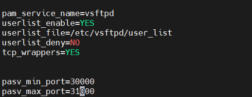


- **Giới hạn User được phép truy cập vào hệ thống**: Nếu muốn giới hạn các User local được đăng nhập vào hệ thống FTP server. Ta thêm vào các dòng sau. Khi đó, những User có trong file /etc/vsftpd/user_list mới được truy cập vào hệ thống.


```
userlist_enable=YES
userlist_file=/etc/vsftpd/user_list
userlist_deny=NO
```

- **Home directory**: ta có thể chỉ định thư mục home khi người dùng đăng nhập vào hệ thống

```
local_root=<đường_dẫn_thư_mục>
```

- **Thời gian hệ thống**: ta sử dụng thời gian local:

```
use_local_time-YES
```

## 1.3.Khởi động lại dịch vụ và cho phép các cổng FTP passive đi qua tường lửa

```
# systemctl restart vsftpd

# firewall-cmd --permanent --add-port=30000-31000/tcp
success

# firewall-cmd --reload
success
```
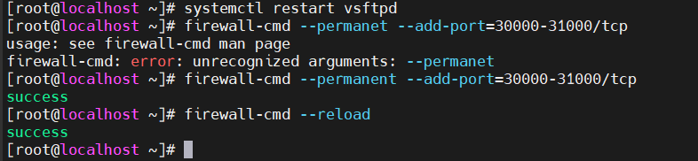


# 2.Truy cập FTP Server

Để truy cập FTP server, ta cần 1 tài khoản local và được cấp quyền truy cập vào FTP server.


## 2.1. Tạo user local

Tạo 1 local user là: `ducthien`với mật khẩu là `vnpt1`

```
# adduser ducthien
# passwd ducthien
```

Sau khi thêm xong thì thư mục mặc định của tài khoản này sẽ ở thư mục /home/ducthien/

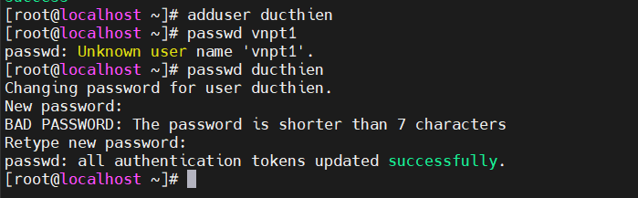

## 2.2. Cấp quyền truy cập đến FTP server

Ta thêm user `ducthien` vào file `/etc/vsftpd/user_list` để có thể truy cập vào server.


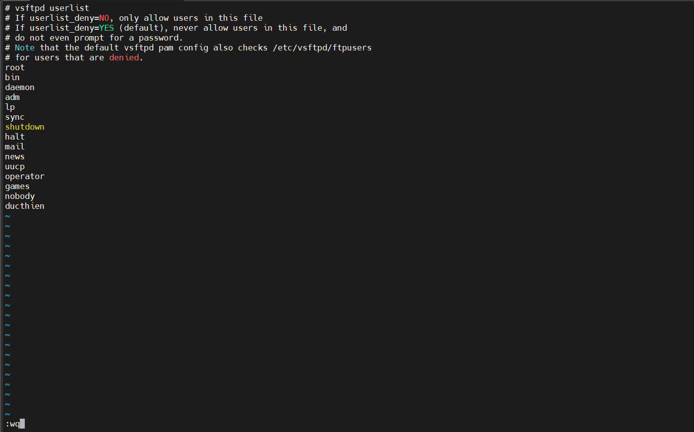

Thêm vào file `/etc/vsftpd/chroot_list `(Nếu bạn sử dụng trong file cấu hình)

Sau đó restart lại dịch vụ `vsftpd`

## 2.3.Truy cập FTP server

Có nhiều cách để có thể truy cập FTP server như :

- lftp trên CentOS-7
- cmd trên Window
- FileZilla trên Window

Truy cập bằng CMD trên Window

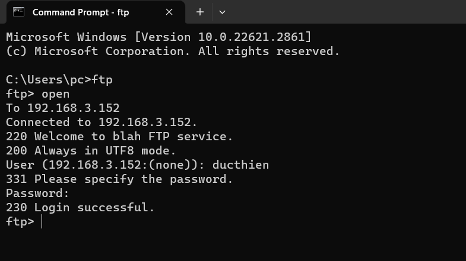


*Tài liệu tham khảo*

[1] [https://news.cloud365.vn/ftp-huong-dan-cau-hinh-ftp-server-tren-centos-7-voi-vsftpd/](https://news.cloud365.vn/ftp-huong-dan-cau-hinh-ftp-server-tren-centos-7-voi-vsftpd/)

