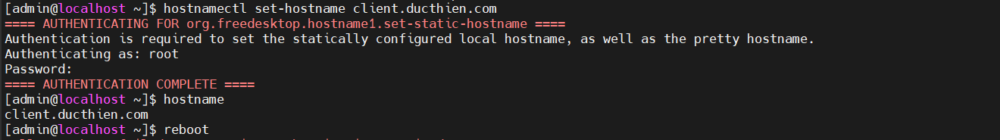
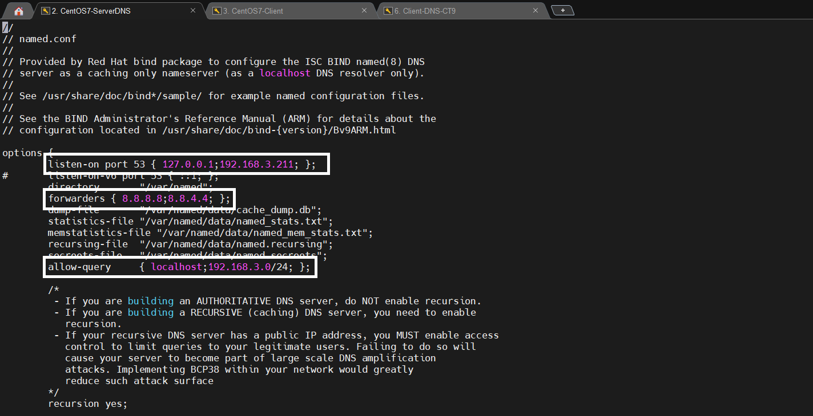
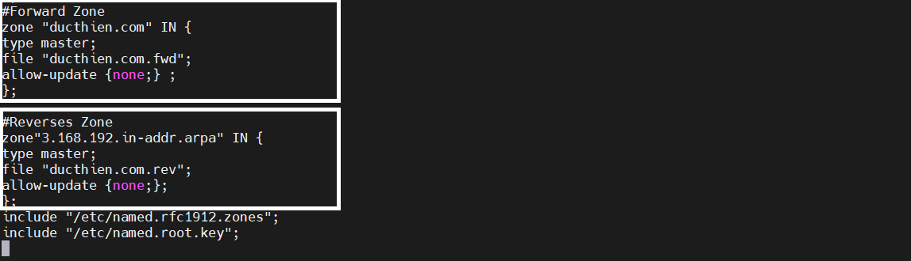
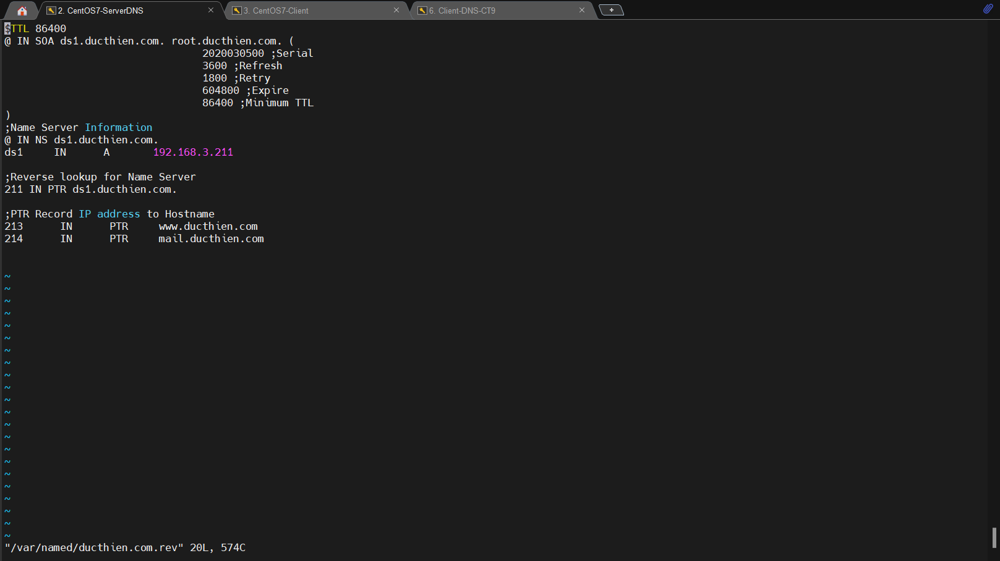

# Triển khai mô hình DNS Server trên Centos7

**1.Thay đổi tên máy chủ DNS Server**

```
hostnamectl set-hostname vnpt1.vinaphone.vn

```



**2.Disable SELINUX**
Ta truy cập file config của SELINUX và đổi thành disable

```
vi /etc/selinux/config
```


**3.Cài đặt DNS Server trên vnpt1**
```
yum install bind* -y

```

**4.Cấu hình tập tin**

Chỉnh sửa tập tin cấu hình của `Bind '/etc/named.conf'.`

```
vi /etc/named.conf
```
Ta sẽ thêm địa chỉ ip dns server sau dòng `listen-on port 53 { 127.0.0.1;`
Thêm dòng `forwarders (8.8.8.8;8.8.4.4;);`
Thêm dải mạng ở dòng `allow-query     { localhost;192.168.3.0/24; };`
Sau khi thêm sẽ được như hình dưới 




Xuống cuối file thêm `Foward Zone` 

```
#Forward Zone
zone"vnpt1.vn" IN {
type master;
file "forward vnpt1.vn";
allow-update {none;} ;
};

```

và `Reverse Zone`

```
#Reverses Zone
zone"3.168.192.in-addr.arpa" IN {
type master;
file "reverse.vnpt1.vn";
allow-update {none;};
};

```



**5.Tạo tập tin Forward.vnpt1.vn và Reverse.vnpt1.vn**
Ta tạo file Forward.vnpt1.vn 
`vi /var/named/forward.vnpt1.vn`

Sau đó thêm nội dung phía dưới 
```
$TTL 86400
@   IN  SOA     vnpt1.vinaphone.vn. root.vinaphone.vn. (
        2011071001  ;Serial
        3600        ;Refresh
        1800        ;Retry
        604800      ;Expire
        86400       ;Minimum TTL
)
@                        IN  NS          vnpt1.vinaphone.vn
@                        IN  A           192.168.3.156
@                        IN  A           192.168.3.157
@                        IN  A           192.168.3.156
vnpt1                    IN  A           192.168.3.156
vnpt2                    IN  A           192.168.3.157

```


Ta tạo file Reverse.vnpt1.vn
`vi /var/named/reverse.vnpt1.vn`

Sau đó thêm nội dung phía dưới
```

$TTL 86400
@   IN  SOA     vnpt1.vinaphone.vn. root.vinaphone.vn. (
        2011071001  ;Serial
        3600        ;Refresh
        1800        ;Retry
        604800      ;Expire
        86400       ;Minimum TTL
)
@                     IN  NS          vnpt1.vinaphone.vn.
@                     IN  NS          vinaphone.vn.
vnpt1                 IN  A           192.168.3.156
vnpt2                 IN  A           192.168.3.157
156                   IN  PTR         vnpt1.vinaphone.vn
157                   IN  PTR         vnpt2.vinaphone.vn.

```



**6.Bật dịch vụ DNS**
Ta dùng lệnh sau 
```
systemctl enable named
systemctl start named
```