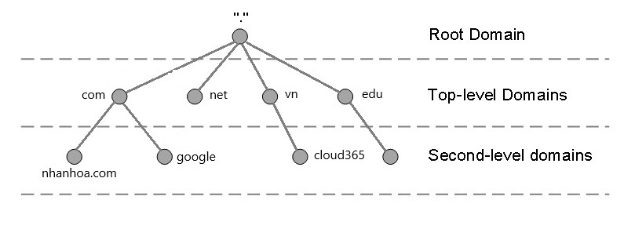

# TÌM HIỂU VỀ DNS
# 1.DNS là gì
## 1.1.Khái niệm
DNS (Domain Name System) – hệ thống tên miền – là một hệ thống cho phép thiết lập tương ứng giữa địa chỉ IP và tên miền trên Internet.
Toàn bộ máy tính trên Internet, từ smart phone, laptop, PC đến các server phục vụ các service như websites, mail,.. đều giao tiếp với nhau thông qua địa chỉ IP. Tuy nhiên, địa chỉ IP này đối với các website có thể khác nhau và khó ghi nhớ đối với người dùng.
Hệ thống DNS nắm vai trò như một cuốn “danh bạ” để đối chiếu với tên miền và trả lại cho người dùng IP của máy chủ.

Địa chỉ IP của một tên miền cụ thể có thể kiểm tra thông qua việc sử dụng lệnh ping trong cmd (Windows):\

Trong ví dụ, tên miền google.com có IP là 8.8.8.8

## 1.2.Tên miền

- Tên miền gốc (root domain): Nó là đỉnh của nhánh cây của tên miền. Nó có thể biểu diễn đơn giản chỉ là dấu chấm “.”
- Tên miền cấp cao nhất - Top-level domain (TLD) : Top-level domain nằm ở đầu phân cấp về tên miền. ICANN (Internet Corporation for Assigned Names and Numbers) là tổ chức được cấp quyền kiểm soát quản lý đối với các tên miền cấp cao nhất. Sau đó có thể phân phối tên miền bên dưới TLD, thường thông qua một công ty đăng ký tên miền (domain registrar). Top-level domain là phần xa nhất ở bên phải (được phân tách bằng dấu chấm). Các tên miền cấp cao phổ biến là “com”, “net”, “org”, “gov”, “edu”,..
  - Com: Tên miền này được dùng cho các tổ chức thương mại.
  - Edu: Tên miền này được dùng cho các cơ quan giáo dục, trường học.
  - Net: Tên miền này được dùng cho các tổ chức mạng lớn.
  - Gov: Tên miền này được dùng cho các tổ chức chính phủ.
  - Org: Tên miền này được dùng cho các tổ chức khác.
  - Info: Tên miền này dùng cho việc phục vụ thông tin.

- Host : Với tên miền, chủ sở hữu có thể tham chiếu đến các máy tính hoặc dịch vụ riêng biệt. Chẳng hạn, hầu hết chủ sở hữu tên miền làm cho máy chủ web của họ có thể truy cập được thông qua tên miền (cloud365.vn) và cũng thông qua định nghĩa “máy chủ” “www” (www.cloud365.vn).
- Tên miền con (Subdomain) : DNS hoạt động theo thứ bậc. TLD có thể có nhiều tên miền bên dưới. Chẳng hạn, TLD “com” có cả “google.com” và “nhanhoa.com” bên dưới nó. “Tên miền con” là tên miền thuộc một phần của tên miền lớn hơn. Trong trường hợp này, “nhanhoa.com” có thể được coi là tên miền con của “com”. Phần “nhanhoa” được gọi là SLD (second level domain), có nghĩa là tên miền cấp hai.

## 1.3.Chức năng của DNS

- Tất cả các thiết bị trên Internet có thể giao tiếp được với nhau là nhờ có địa chỉ IP(IPv4 và IPv6). Khi bạn muốn truy cập vào 1 trang web như facebook.com, github.com, dantri.com.vn,… thì bản chất thực sự của nó là truy cập vào địa chỉ IP của server chứa dữ liệu của các trang web này. Tuy nhiên không phải ai cũng có thể nhớ được đúng và nhớ được hết địa chỉ IP của các trang web, từ đó DNS đã xuất hiện.
- DNS đóng vai trò như 1 người phiên dịch, dịch giữa địa chỉ IP và tên miền chứ không có tác dụng thay thế hoàn toàn cho địa chỉ IP. Bạn cũng có thể tải 1 website bằng cách nhập trực tiếp địa chỉ IP thay vì dùng tên miền nếu bạn biết và nhớ địa chỉ IP của trang web đó. Ví dụ, khi bạn gõ “www.google.com” vào trình duyệt, máy chủ DNS sẽ lấy địa chỉ IP của máy chủ Google là “74.125.236.37”. Sau đó, bạn sẽ nhìn thấy trang chủ Google tải trang trên trình duyệt. Đó là quá trình phân giải DNS.
- Mỗi DNS còn có chức năng ghi nhớ những tên miền mà nó đã phân giải và ưu tiên sử dụng cho những lần truy cập sau.
- Nhờ DNS, bạn có thể sử dụng nhiều dịch vụ mạng như tìm kiếm thông tin, xem phim, chơi game, đăng nhập các website,…Có thể nói nếu không có DNS, con người không thể duyệt Internet nhanh chóng và dễ dàng như ngày nay.

## 1.4.Các thành phần của DNS
Dịch vụ DNS bao gồm 4 thành phần:

- DNS Cache
- Resolvers
- Name servers
- Name space

1. DNS cache

Thuật ngữ này thường bị nhầm lẫn do nó có ít nhất 2 ý nghĩa. Đầu tiên DNS Cache có thể là danh sách tên và địa chỉ IP mà bạn đã truy vấn và đã được giải quyết và được lưu vào bộ nhớ cache để không có lưu lượng truy cập mạng được tạo ra và truy cập nhanh hơn. Ý nghĩa thứ hai liên quan đến một DNS Server chỉ đơn giản là thực hiện các truy vấn đệ quy và bộ đệm ẩn mà không thực sự là một máy chủ có thẩm

2. Resolvers

Là bất kỳ host nào trên Internet cần dùng để tra cứu thông tin tên miền, giống như thiết bị bạn đang sử dụng để đọc trang web này.

3. Name servers

Những server này chứa cơ sở dữ liệu về tên và địa chỉ IP và phục vụ các yêu cầu DNS cho client.

4. Name space

Là cơ sở dữ liệu về địa chỉ IP và các tên liên quan của chúng.

# 2.Các loại DNS Servers

- `Primary DNS servers`: chứa các file cấu hình tên miền và phản hồi các truy vấn DNS
- `Secondary DNS server`: làm việc như một backup và load balancer server. Các Primary DNS server biết sự tồn tại của Secondary DNS server và sẽ gửi các bản cập nhật cho chúng.
- `Caching DNS server`: làm nhiệm vụ lưu trữ các phản hồi DNS nhờ vậy bạn sẽ không cần hỏi lại Primary DNS server trong lần thứ 2 truy cập vào website.

# 3.Cách hoạt động của DNS

Ví dụ bạn muốn truy cập vào google.com

1. Yêu cầu tìm kiếm địa chỉ IP ứng với tên miền google.com sẽ được gửi từ máy người dùng tới Name server cục bộ 
2. Máy chủ domain cục bộ sẽ tìm kiếm trong kho dữ liệu xem có cơ sở dữ liệu chuyển đổi từ tên miền sang địa chỉ IP của domain mà người dùng yêu cầu hay không .Nếu có thì cơ sở dữ liệu sẽ được gửi trả lại địa chỉ IP của máy có tên miền đó
3. Nếu không có cơ sở dữ liệu về domain yêu cầu , máy chủ tên miền cục bộ sẽ hỏi các máy chủ tên miền ở mức cao nhất (ROOT). Máy chỉ domain mức cao nhât (mức ROOT) sẽ chỉ cho máy chủ domain cục bộ mà nó quản lý có đuôi .com
4. Máy chủ doamin cục bộ gửi yêu cầu đến máy chủ quản lý domain ".com" - domain tổ chức thương mại để tìm tên Google.com
5. Máy chủ domain cục bộ hỏi máy chủ quản lý domain ".com" địa chỉ IP domain "google.com" => có => gửi trả 
6. Máy chủ domain cục bộ chuyển thông tin đến máy của người dùng 
7. Người dùng sẽ dùng địa chỉ IP này kết nối đến máy chủ chứ website có địa chỉ google.com

# 4.Các loại bản ghi trên DNS
## 4.1. SOA (Start of Authority)
Trong mỗi tập tin cơ sở dữ liệu DNS phải có một và chỉ một bản ghi SOA (Start of Authority). Bao gồm các thông tin về domain trên DNS Server, thông tin về zone transfer.

*Tài liệu tham khảo*

[1] [https://blog.cloud365.vn/linux/dns-introduction/](https://blog.cloud365.vn/linux/dns-introduction/)
[2] [https://news.cloud365.vn/dns-va-cac-khai-niem-lien-quan/](https://news.cloud365.vn/dns-va-cac-khai-niem-lien-quan/)
[3] [https://www.bkns.vn/dns-la-gi.html#DNS_hoat_dong_nhu_the_nao](https://www.bkns.vn/dns-la-gi.html#DNS_hoat_dong_nhu_the_nao)
[4] [https://blog.cloud365.vn/linux/dns-record/](https://blog.cloud365.vn/linux/dns-record/)