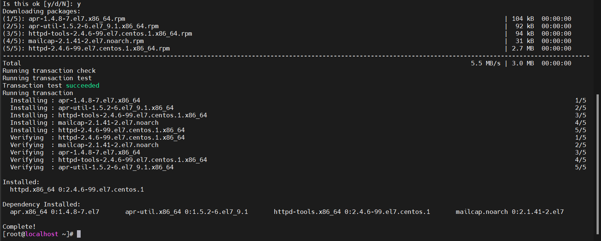
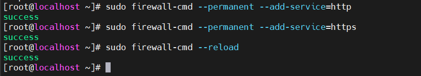

# 1.Cài đặt web server Apache trên CentOS
- Bước 1: Cài đặt Apache

`yum install httpd -y`

- Bước 2: Khởi động Apache

`systemctl enable httpd`
`systemctl start httpd`

- Bước 3: Kiểm tra trạng thái Apache

`systemctl status httpd`

- Bước 4: Cấu hình Firewall (nếu có)
`firewall-cmd --permanent --zone=public --add-service=http`
`firewall-cmd --permanent --zone=public --add-service=https`
`firewall-cmd --reload`

# 2. Quản lý Apache Service với systemctl

- Để dừng Apache, dùng lệnh

`systemctl stop httpd`

- Để khởi động Apache dùng lệnh

`systemctl start httpd`

- Lệnh khởi động lại Apache

`systemctl restart httpd`

- Tải lại dịch vụ Apache mỗi khi bạn thay đổi cấu hình

`systemctl reload httpd`

- Nếu không muốn Apache tự động chạy mỗi khi khởi động lại VPS sử dụng lệnh sau

`systemctl disable httpd`

- Nếu muốn Apache tự động chạy mỗi khi khởi động lại VPS sử dụng lệnh sau

`systemctl enable httpd`

# 3.Các file cấu hình 
# 4.Cấu hình Virtual Host

## 4.1. Bật Userdir