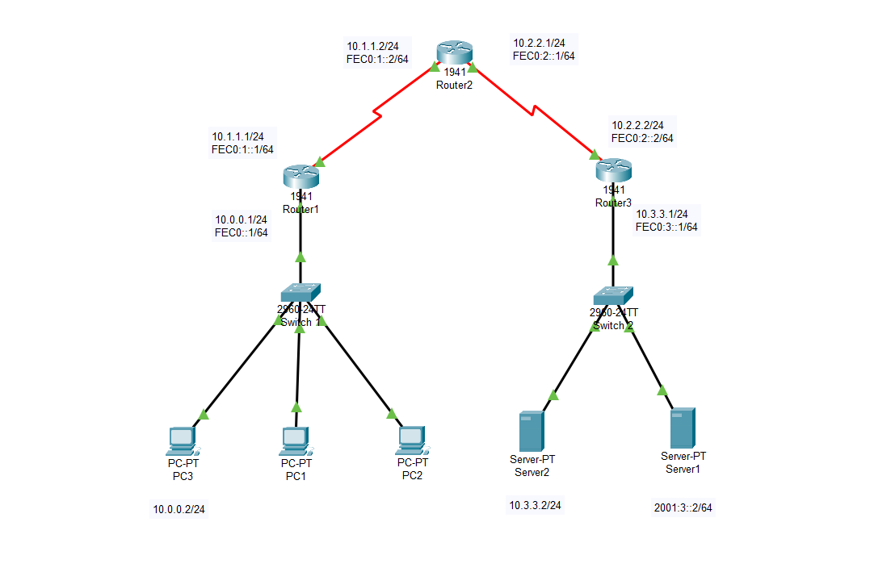

# CẤU HÌNH DUAL STACK 

## Cấu hình trên Router 1
> Router>enable
Router#configure terminal
Router(config)#hostname R1
R1(config)#enable secret class
R1(config)#line console 0
R1(config-line)#pass Cisco
R1(config-line)#login
R1(config-line)#
R1(config-line)#exit
R1(config)#banner motd #Router R1#
R1(config)#service password-encryption
R1(config)#ipv6 unicast-routing
R1(config)#ipv6 router rip haku
R1(config-rtr)#exit
R1(config)#int g0/0
R1(config-if)#ip add 192.168.10.1 255.255.255.0
R1(config-if)#ipv6 add fe80::1 link-local
R1(config-if)#duplex auto
R1(config-if)#speed auto
R1(config-if)#no shut
R1(config-if)#exit
R1(config)#int g0/1
R1(config-if)#ip add 192.168.11.1 255.255.255.0
R1(config-if)#ipv6 add 2001:db8:acad:2::1/62
R1(config-if)#ipv6 rip haku enable
R1(config-if)#duplex auto
R1(config-if)#speed auto
R1(config-if)#no shut

## Đặt địa chỉ mạng trên PC1

## Đặt địa chỉ mạng trên PC2

## Cấu hình trên Router 2
> Router>enable
Router#configure terminal
Router(config)#hostname R2
R2(config)#enable secret class
R2(config)#line console 0
R2(config-line)#pass Cisco
R2(config-line)#login
R2(config-line)#
R2(config-line)#exit
R2(config)#banner motd #Router R2#
R2(config)#service password-encryption
R2(config)#ipv6 unicast-routing
R2(config)#ipv6 router rip haku
R2(config-rtr)#exit
R2(config)#int g0/0
R2(config-if)#ip add 10.1.1.1 255.255.255.0
R2(config-if)#ipv6 add 2001:db8:acad:4::1/64
R2(config-if)#ipv6 add fe80::1 link-local
R2(config-if)#duplex auto
R2(config-if)#speed auto
R2(config-if)#no shut
R2(config-if)#exit
R2(config)#int g0/1
R2(config-if)#ip add 10.1.2.1 255.255.255.0
R2(config-if)#ipv6 add 2001:db8:acad:5::1/62
R2(config-if)#ipv6 rip haku enable
R2(config-if)#duplex auto
R2(config-if)#speed auto
R2(config-if)#no shut

## Đặt địa chỉ mạng trên PC3

## Đặt địa chỉ mạng trên PC4

>R1(config)#ipv6 router rip haku
R1(config-rtr)#exit
R1(config)#int g0/0
R1(config-if)#ipv6 rip haku enable 
R1(config-if)#exit
R1(config)#int g0/1
R1(config-if)#ipv6 rip haku enable 
R1(config-if)#exit
R1(config)#int s0/1/0
R1(config-if)#ip add 209.165.200.225 255.255.255.255
Bad mask /32 for address 209.165.200.225
R1(config-if)#ipv6 add 2001:db8:3::225/64
R1(config-if)#ipv6 add fe80::1 link-local 
R1(config-if)#ipv6 rip haku
R1(config-if)#ipv6 rip haku enable 
R1(config-if)#no shut
R1(config-if)#exit
R1(config)#router rip
R1(config-router)#network 192.168.10.0
R1(config-router)#network 192.168.11.0
R1(config-router)#network 209.165.200.0
R1(config-router)#exit

