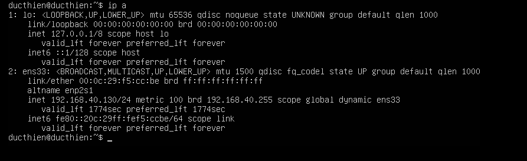
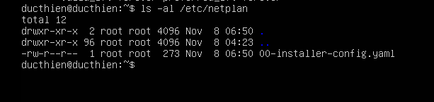
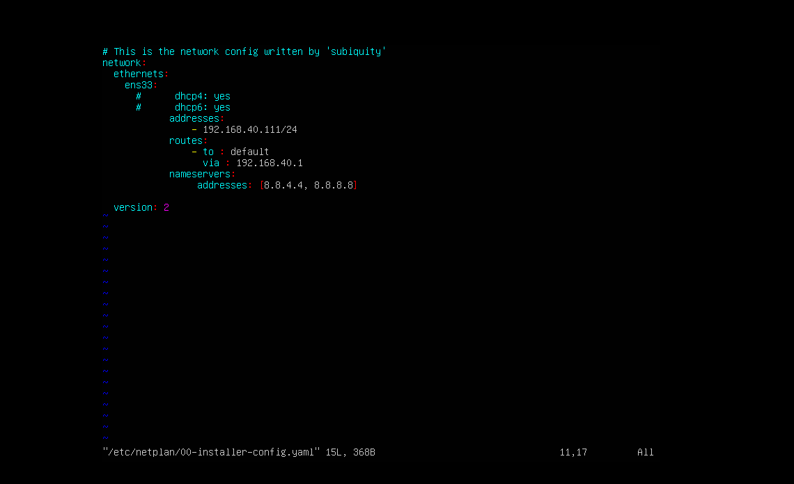

# Cấu hình Static IP trên Ubuntu

## Cấu hình bằng dòng lệnh 

Kiểm tra card mạng và địa chỉ IP

`ip a`

Kiểm tra vị trí file config

`ls -al /etc/netplan/`

Tiến hành truy cập và sửa file config

`sudo vi /etc/netplan/01-network-manager-all.yaml`

Ở trong file cấu hình , ta sẽ xóa đi dòng

`dhcp:yes`

Thêm các dòng
`addresses:  `
        `- 192.168.1.111/24 `
      `routes:  `
       ` - to: default  `
          `via: 192.168.1.1 `
      `nameservers:  `
       ` addresses: [8.8.4.4, 8.8.8.8]  `

Sau khi thêm các nội dung trên ta bấm *ESC* và gõ *:wq* để lưu và thoát 
Dùng câu lệnh phía dưới để apply những gì vừa cài đặt

`sudo netplan apply`

như vậy là ta đã set static ip thành công 
