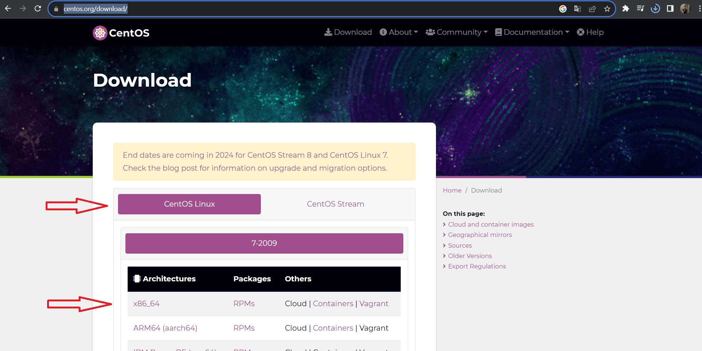
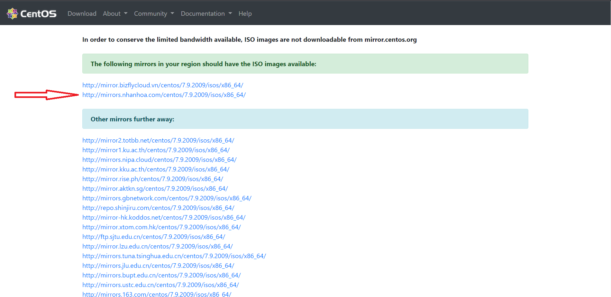
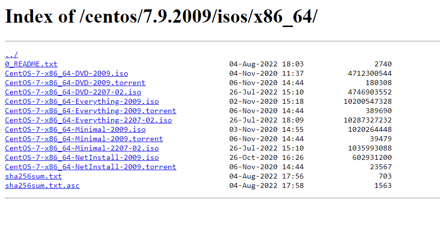

# 1. Tải bản ISO centos 7 
Truy cập đường link : [https://www.centos.org/download/](https://www.centos.org/download/)

Sau khi truy cập , chọn mục Centos Linux , chọn X86_64

Giao diện chuyển đến các đường link lưu trữ

Ở đây sẽ xuất hiện các phiên bản cài đặt , ta sẽ chọn bản đầy đủ 
