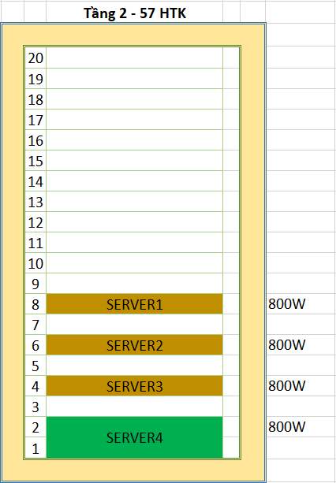

# 1.Danh sách thiết bị 

**Database server**
|Danh mục | Thông số |
|------------|-------|
|STT|1|
|Nhóm chức năng|  Database serve|
|Tên thiết bị|  HPE ProLiant DL360 Gen1|
|Mã thiết bị|  DATABASE-1|
|Hostname| database-1|
|Công suất nguồn|  800 |
|Số U| 1 | 
|Tủ rack|  Tầng 2 - 57HT|
|Vị trí|  U8 |
|Số lượng| 1 |

*Cấu hình đầu tư*
- Máy chủ AI + eReception : HPE DL360 
- HPE ProLiant DL360 Gen10 8SFF NC Configure-to-order Server
- HPE DL360 Gen10 8SFF ModX CTO
- Intel Xeon-Silver 4210 (2.2GHz/10-core/85W) FIO Processor Kit for HPE ProLiant DL360 Gen10
- HPE 16GB (1x16GB) Dual Rank x8 DDR4-2933 CAS-21-21-21 Registered SAM Memory Kit
- HPE 960GB SATA 6G Read Intensive SFF (2.5in) SC 3yr Wty Multi Vendor SSD
- HPE Smart Array E208i-a SR Gen10 (8 Internal Lanes/No Cache) 12G SAS Modular Controller
- HPE Ethernet 1Gb 4-port FLR-T I350-T4V2 Adapter
- HPE 800W Flex Slot Platinum Hot Plug Low Halogen Power Supply Kit
- HPE 1U Gen10 SFF Easy Install Rail Kit

|Danh mục | Thông số |
|------------|-------|
|STT | 2|
|Nhóm chức năng | Database server|
|Tên thiết bị | HPE ProLiant DL360 Gen10|
|Mã thiết bị | DATABASE-2|
|Hostname |database-2|
|Công suất nguồn | 800|
|Số U | 1|
|Tủ rack | Tầng 2 - 57HTK|
|Vị trí | U6|
|Số lượng |1|

*Cấu hình đầu tư*
- Máy chủ OCR: HPE DL360
- HPE ProLiant DL360 Gen10 8SFF NC Configure-to-order Server
- HPE DL360 Gen10 8SFF ModX CTO
- Intel Xeon-Silver 4210 (2.2GHz/10-core/85W) FIO Processor Kit for HPE ProLiant DL360 Gen10
- HPE 16GB (1x16GB) Dual Rank x8 DDR4-2933 CAS-21-21-21 Registered SAM Memory Kit
- HPE 960GB SATA 6G Read Intensive SFF (2.5in) SC 3yr Wty Multi Vendor SSD
- HPE Smart Array E208i-a SR Gen10 (8 Internal Lanes/No Cache) 12G SAS Modular Controller
- HPE Ethernet 1Gb 4-port FLR-T I350-T4V2 Adapter
- HPE 800W Flex Slot Platinum Hot Plug Low Halogen Power Supply Kit
- HPE 1U Gen10 SFF Easy Install Rail Kit

**Application server**

|Danh mục | Thông số |
|------------|-------|
|STT|1|
|Nhóm chức năng|  Application server|
|Tên thiết bị|  HPE ProLiant DL360 Gen1|
|Mã thiết bị|  APPLICATION-1|
|Hostname| application-1|
|Công suất nguồn|  800 |
|Số U| 1 | 
|Tủ rack|  Tầng 2 - 57HT|
|Vị trí|  U4|
|Số lượng| 1 |

*Cấu hình đầu tư*
- Máy chủ AI: HPE DL360
- HPE ProLiant DL360 Gen10 8SFF NC Configure-to-order Server
- HPE DL360 Gen10 8SFF ModX CTO
- Intel Xeon-Gold 6226R (2.9GHz/16-core/150W) FIO Processor Kit for HPE ProLiant DL360 Gen10
- Intel Xeon-Gold 6226R (2.9GHz/16-core/150W) Processor Kit for HPE ProLiant DL360 Gen10
- HPE 32GB (1x32GB) Dual Rank x4 DDR4-2933 CAS-21-21-21 SAM Memory Kit
- HPE 960GB SATA 6G Read Intensive SFF (2.5in) SC 3yr Wty Multi Vendor SSD
- HPE DL360 Gen10 2P FH GPU Enablement v2 Kit
- NVIDIA T4 16GB Computational Accelerator for HPE
- HPE Smart Array E208i-a SR Gen10 (8 Internal Lanes/No Cache) 12G SAS Modular Controller
- HPE Ethernet 1Gb 4-port FLR-T I350-T4V2 Adapter
- HPE DL360 Gen10 High Performance Fan Kit
- HPE 800W Flex Slot Platinum Hot Plug Low Halogen Power Supply Kit
- HPE 1U Gen10 SFF Easy Install Rail Kit

|Danh mục | Thông số |
|------------|-------|
|STT|2|
|Nhóm chức năng|  Application server|
|Tên thiết bị|  HPE ProLiant DL360 Gen1|
|Mã thiết bị|  APPLICATION-2|
|Hostname| application-2|
|Công suất nguồn|  800 |
|Số U| 1 | 
|Tủ rack|  Tầng 2 - 57HT|
|Vị trí|  U1|
|Số lượng| 1 |

*Cấu hình đầu tư*
- Máy chủ điểm danh và kiểm soát an ninh: HPE DL380
- HPE ProLiant DL380 Gen10 8LFF NC Configure-to-order Server
- HPE DL380 G10 CTO Mod-X 8LFF WO NIC
- Intel Xeon-Silver 4214 (2.2GHz/12-core/85W) FIO Processor Kit for HPE ProLiant DL380 Gen10
- Intel Xeon-Silver 4214 (2.2GHz/12-core/85W) Processor Kit for HPE ProLiant DL380 Gen10
- HPE 32GB (1x32GB) Dual Rank x4 DDR4-2933 CAS-21-21-21 SAM Memory Kit
- HPE DL38X Gen10 8LFF Front 2SFF SAS/SATA HDD Kit
- HPE 960GB SATA 6G Read Intensive SFF (2.5in) SC 3yr Wty Multi Vendor SSD
- HPE 10TB SAS 12G Midline 7.2K LFF (3.5in) SC 1yr Wty Helium 512e Digitally Signed Firmware HDD
- HPE Smart Array E208i-a SR Gen10 (8 Internal Lanes/No Cache) 12G SAS Modular Controller
- HPE Ethernet 1Gb 4-port FLR-T I350-T4V2 Adapter
- HPE 800W Flex Slot Platinum Hot Plug Low Halogen Power Supply Kit
- HPE 2U Large Form Factor Easy Install Rail Kit

# 2.Rack layout

