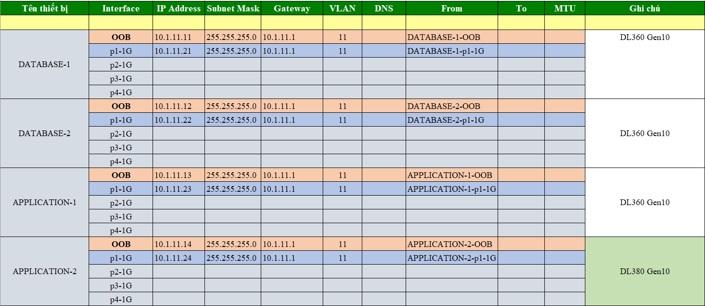

# 1.Dải IP được cấp 

|VLAN ID | Dải IP | Mask| Gateway | CIDR| Loại|
|--|--|--|--|--|------------------------------|
|VLAN 11|10.1.11.11-254|255.255.255.0|10.1.11.1|10.1.11.0/24|Intranet|

# 2.Phân hoạch IP

# 3. Yêu cầu cài đặt 

|STT|Server|Số lượng | Yêu cầu cài đặt |Ghi chú|
|----------------|---|-|-|-|
|1|Database server|2|Mô hình Master-slave,Cài đặt MySQL database 8, Cầu hình firewall  mềm để chặn truy cập trái phép|
|2|Application server|2|Mô hình Active-standby, OS: Ubuntu 22,Cài đặt Java 8, Tomcat, redis, RabbitMQ, Cầu hình firewall  mềm để chặn truy cập trái phép|