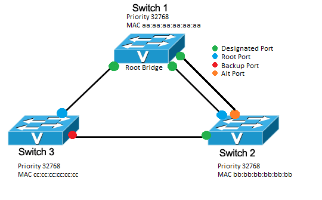

# 1 VLAN là gì 
## 1.1 Mạng LAN là gì 
LAN là một mạng cục bộ ( Local Area Network ) được hiểu là sự kết hợp của nhiều thiết bị được kết nối lại với nhau trong một hệ thống mạng tại một khu vực nhất định ( công ty , trường học , nhà ở ...) Việc ghép nối các thiết bị trong cùng một hệ thống cho phép các thiết bị này trao đổi dữ liệu với nhau một cách nhanh chóng và dễ dàng .  
       
Những thiết bị trong cùng mạng LAN có thể kết nối với nhau thông qua sợi cáp mạng . Gộp nhiều mạng LAN có thể truy cập với nhau tạo ra một mạng lưới rộng lớn hơn được gọi là WAN (Wide Area Network) và để giao tiếp với nhau , các thiết bị được kết nối với một hoặc nhiều thiết bị thu phát tín hiệu mạng (Router)

## 1.2 VLAN là gì   
- VLAN là viết tắt của Virtual local area network hay còn gọi là mạng LAN ảo, cho phép chia một con Switch vật lý thành nhiều con Switch ảo, trên một con Switch sẽ tạo được từ VLAN 0 đến VLAN 4095 ( 4096 VLAN ) . Mạng LAN ảo (VLAN) là một nhóm các máy tính được kết nối với cùng một mạng không ở gần nhau . Sử dụng VLAN cho phép sử dụng tài nguyên hiệu quả và có thể hữu ích khi có quá nhiều thiết bị trên một mạng .  

- Khác biệt giữa VLAN và LAN 

|Đặc Điểm | VLAN | LAN |
|---------|------|-----|
|Định nghĩa|Mạng cục bộ LAN là một tập hợp các máy tính và thiết bị ngoại vi được liên kết trong một khu vực địa lý cụ thể | VLAN là một mạng LAN ảo tùy chỉnh được tạo thành từ một hoặc nhiều mạng LAN|
|Độ trễ| Độ trễ mạng LAN lớn hơn | Đô trễ VLAN giảm xuống |
|Chi phí | Cao hơn | Thấp hơn |
|Cách thức hoạt động | Các gói mạng được Broadcast gửi tới từng thiết bị trong mạng LAN |Các gói mạng trong VLAN chỉ được gửi đến một địa chỉ Broadcast duy nhất |
|Giao thức |Sử dụng giao thức FDDI | Sử dụng giao thức STP , VTP,ISP|
 
## 1.3 Phân loại VLAN 
- Static VLAN (VLAN tĩnh)
Static VLAN được tạo ra bằng cách cách gán các cổng của mỗi Switch thành một mạng VLAN. Mỗi cổng nằm trên một VLAN và chỉ giao tiếp, kết nối với những VLAN được chỉ định. Trong nhiều trường hợp các VLAN tĩnh có thể thay đổi nhanh chóng bằng thủ công hoặc tự động hóa mạng.

- Dynamic VLAN (VLAN động)
Khác với Static VLAN, Dynamic VLAN được tạo ra dựa trên loại lưu lượng hoặc thiết bị tạo ra lưu lượng. Thông thường kỹ sư mạng sẽ dùng phần mềm điển hình cisco work 2000 để tạo ra Dynamic VLAN. Một cổng có thể gán cho một VLAN dựa trên địa chỉ Mac nguồn của loại thiết bị đính kèm.
## 1.4 Công dụng của VLAN
**Tiết kiệm băng thông của hệ thống mạng**: VLAN chia mạng LAN thành nhiều đoạn (segment) nhỏ, mỗi đoạn đó là một vùng quảng bá (broadcast domain). Khi có gói tin quảng bá (broadcast), nó sẽ được truyền duy nhất trong VLAN tương ứng. Do đó việc chia VLAN giúp tiết kiệm băng thông của hệ thống mạng.
**Tăng khả năng bảo mật**: Do các thiết bị ở các VLAN khác nhau không thể truy nhập vào nhau (trừ khi ta sử dụng router nối giữa các VLAN). Như trong ví dụ trên, các máy tính trong VLAN kế toán (Accounting) chỉ có thể liên lạc được với nhau. Máy ở VLAN kế toán không thể kết nối được với máy tính ở VLAN kỹ sư (Engineering).
**Dễ dàng thêm hay bớt máy tính vào VLAN**: Việc thêm một máy tính vào VLAN rất đơn giản, chỉ cần cấu hình cổng cho máy đó vào VLAN mong muốn.
**Giúp mạng có tính linh động cao**: VLAN có thể dễ dàng di chuyển các thiết bị. Giả sử trong ví dụ trên, sau một thời gian sử dụng công ty quyết định để mỗi bộ phận ở một tầng riêng biệt. Với VLAN, ta chỉ cần cấu hình lại các cổng switch rồi đặt chúng vào các VLAN theo yêu cầu. VLAN có thể được cấu hình tĩnh hay động. Trong cấu hình tĩnh, người quản trị mạng phải cấu hình cho từng cổng của mỗi switch. Sau đó, gán cho nó vào một VLAN nào đó. Trong cấu hình động mỗi cổng của switch có thể tự cấu hình VLAN cho mình dựa vào địa chỉ MAC của thiết bị được kết nối vào
## 1.5 Cách thức hoạt động động của VLAN
Một VLAN được xác định trên các Switch bằng một ID VLAN . Mỗi cổng trên một Switch sẽ được gán cho một hoặc nhiều VLAN ID , trường hợp không được chỉ định thì nó sẽ được chuyển tới một VLAN mặc định . Mỗi VLAN sẽ cung cấp quyền truy cập dữ liệu cho tất cả các thiết bị kết nối với cổng Switch phù hợp với VLAN ID của nó  
ID VLAN sẽ được dịch sang thẻ VLAN bằng một thẻ 12 bit xác định tối đa 4096 VLAN trên mỗi miền truyển mạch . IEEE sẽ chịu trách nhiệm gắn VLAN theo tiêu chuẩn 802.1Q . Switch sẽ thêm thẻ VLAN cho khung Ethernet. Với Static VLAN, switch sẽ chèn thẻ được liên kết với ID VLAN của cổng nhập . Riêng Danamic VLAN , Switch sẽ chèn thẻ được liên kết với ID của thiết bị đó hoặc loại lưu lượng nó tạo ra   
Các khung Ethernet được gắn thẻ sẽ chuyển tiếp về địa chỉ MAC đích của chúng (chỉ chuyển tiếp đến các cổng có liên kết VLAN )Lưu lượng quảng bá (broadcast), unicast, multicast đều được chuyển tiếp đến các cổng trong VLAN.
Đường trung kế kết nối (Truck) giữa các switch nhận biết được VLAN nào trải dài trên switch. Truck còn đóng vai trò truyền lưu lượng truy cập cho các VLAN được sử dụng ở hai phía đầu, cuối của nó. Khi một khung chạm đến switch đích thì thẻ VLAN sẽ bị xóa trước khi khung được truyền tới máy tính đích.
Spanning Tree Protocol ( STP )là một giao thức được dùng để ngăn chặn sự lặp vòng giữa các switch trong mỗi miền lớp 2 (Ethernet). Mỗi VLAN sẽ chạy một STP riêng biệt, không phụ thuộc lẫn nhau. Nếu cấu trúc liên kết giữa nhiều VLAN giống nhau thì có thể chạy STP đa trường hợp để giảm chi phí STP.

# 2. Giao thức VTP , STP
## 2.1 Giao thức VLAN Trunking Protocal
###  Khái niệm
VTP (Virtual Trunking Protocol) là một giao thức được sử dụng trong các mạng Ethernet để quản lý thông tin về VLAN (Virtual Local Area Network). Với VTP, các thông tin về VLAN như tên VLAN, số hiệu VLAN và các thông tin khác được đồng bộ hóa và chia sẻ tự động giữa các switch trong mạng.

Với VTP, việc thay đổi cấu hình VLAN chỉ cần thực hiện trên một switch duy nhất, và sau đó thông tin mới sẽ được gửi tới các switch khác trong cùng mạng. Điều này giúp giảm công sức và thời gian cấu hình VLAN trên các switch trong mạng lớn.

Tuy nhiên, cần lưu ý rằng VTP chỉ hoạt động trong các mạng Ethernet sử dụng giao thức IEEE 802.1Q để đánh dấu VLAN. Ngoài ra, cần cấu hình chính xác các thông số như domain name và mode trên các switch để đảm bảo tính chính xác và an toàn trong việc sử dụng VTP.  

### Lợi ích khi sử dụng giao thức VTP 
- Cấu hình đúng các VLAN khi qua mạng , theo dõi chính xác và kiểm tra VLAN
- Hệ thống ánh xạ cho phép 1 VLAN được trunk qua các môi trường chuyền hỗn hợp 
- Báo cáo về việc thêm vào các VLAN và dễ dàng cấu hình khi thêm mới VLAN 
- Biết được VLAN và thông số cụ thể 
### Hạn chế của giao thức VTP 
- VTP không cung cấp tính tin cậy cao. Nếu một thiết bị VTP vô tình được cấu hình sai và được kết nối vào mạng, nó có thể ghi đè lên cấu hình VLAN hiện có trên các thiết bị khác trong cùng một domain VTP. Điều này có thể gây ra sự cố mạng nghiêm trọng hoặc mất dữ liệu.
- VTP không cung cấp các cơ chế bảo mật mạnh. Nó sử dụng một số phương pháp đơn giản như mật khẩu VTP để xác thực và gửi dữ liệu. Mật khẩu VTP được lưu dưới dạng plain text trong cấu hình, điều này có nghĩa là nó có thể dễ dàng bị đánh cắp và gây nguy hiểm cho mạng
- VTP không mở rộng tốt trên các mạng lớn hoặc phân tán. Khi một mạng lớn được chia thành các domain VTP nhỏ hơn, việc đồng bộ hóa thông tin VLAN giữa các domain có thể trở thành một vấn đề phức tạp và tốn nhiều thời gian.

### Các mode của VTP 
Tất cả switch muốn nhận lưu lượng với nhau thì phải cùng tên miền . Các chế độ VTP muốn tham gia vào miền quản lý , mỗi switch phải được cấu hình để hoạt động ở chế độ nhất định nào đó . Ta có 3 chế độ sau 

*Mode server*
Các switch ở mode này sẽ điều khiển việc tạo VLAN và thay đổi domain . Tất cả thông tin VTP đều được quảng bá đến các Switch trong domain . Mặc định một switch hoạt động ở mode server 
    - Tạo VLAN 
    - Chỉnh sửa VLAN 
    - Xóa VLAN
    - Gửi hoặc chuyển thông tin quảng bá
    - Đồng bộ hóa thông tin VLAN
    - Lưu cấu hình vào NVRAM

*Mode client*
Các Switch ở mode này không có quyền tạo sửa xóa bất kì VLAN nào mà chỉ nhận các quảng bá VTP từ các Switch khác và thay đổi cấu hình VLAN của nó . Đây là chế độ lắng nghe thụ động . Các thông tin được VTP chuyển tiếp ra liên kết trunk đến các Switch lân cận trong domain .
    - Chuyển thông tin quảng bá 
    - Đồng bộ hóa thông tin VLAN 
    - Không lưu cấu hình vào NVRAM

*Mode transparent*
Switch ở mode transparent không tham gia trong VTP . Ở mode này , Switch không quảng bá cấu hình VLAN của chính nó và không đồng bộ cở sở dữ liệu VLAN của nó với thông tin quảng bá nhận được mà chỉ quảng bá thông tin VTP nhận được qua cổng trunk của nó 
    - Tạo VLAN trên local 
    - Chỉnh sửa VLAN trên local 
    - Xóa VLAN trên local 
    - Chuyển thông tin quảng bá 
    - Không đồng bộ hóa thông tin trên VLAN
    - Lưu cấu hình vào NVRAM

## 2.2 Giao thức Spanning Tree Protocal
### Khái niệm 
Spanning tree protocal là một giao thức được sử dụng để ngăn chặn một vòng lặp . Giao thức này cho phép các Bridge truyền thông với nhau từ đó phát hiện vòng lặp vật lý trong mạng 

### Lợi ích khi sử dụng giao thức STP
- Cung cấp liên kết dự phòng đồng thời ngăn chặn các vòng lặp không mong muốn 
- Ngăn chặn Broadcast storm
- Kết nối với các thiết bị không hỗ trợ STP , chẳng hạn như PC , máy chủ , bộ định tuyến hoặc trung tâm không được kết nối với các bộ chuyển mạch khác bằng cách sử dụng cổng cạnh 

### Các lỗi loop trong giao thức STP
***Broadcast storm***

Là hiện tượng hệ thống mạng quá tải lưu lượng phát khi cấu hình IP bị trùng hoặc không có địa chỉ IP đích .Điều này làm cho dữ liệu truyền lặp đi lặp lại , khiến hệ thống mạng ngưng hoạt động.
Giả sử PC A tiến hành gửi một broadcast frame vào hệ thống. Khi SwX nhận được frame này nó sẻ đẩy frame ra tất cả các port đến SwY. SwY nhận được broadcast frame này lại tiếp tục gửi ra tất cả các port trừ port nhận vào và quá trình frame này cứ chạy mãi một vòng giữa SwX và SwY. Các Sw cứ nhân bản và flood broadcast frame này ra. Số lượng frame này sẻ ngày càng lớn. Và khi Sw không còn khả năng xử lý nữa thì sẻ khiến Sw bị treo.  

 ***Trùng lặp Frame***
 PCA gửi một unicast frame đến PCB và địa chỉ MAC của B chưa được cập nhật vào bảng MAC của Sw thì Sw sẻ xử lý các frame này như một broadcast frame và flood ra tất cả các port trừ port nhận vào. Và SwX và SwY đều thực hiện chuyển flood frame này ra nhiều port khiến PCB phải xử lí frame này 2 lần.

## Tiến trình bầu chọn và hoạt động của giao thức STP
***Chọn Root-Bridge của Giao thức Spanning Tree***
Một khi tiến trình STP được bật, các Sw sẻ gửi các gói tin BPDU (Bridge Protocol Data Unit) để trao đổi giữa các Switch với nhau, BPDU là một gói tin quan trọng trong tiến trình STP, BPDU chứa một thông tin quan trọng là Bridge-ID của các switch, giá trị này dùng để dịnh danh mỗi Switch khi nào tham gia tiến trình STP.
Bridge ID dài 8 byte,Số Priority(2byte) có giá trị từ 0 – 65535 mặc định là 32768, MAC address(6byte)
Tiến trình bầu chọn Root-Bridge sẻ tiến hành như sau:
- Đầu tiên sẻ so sánh Sw nào có số Priority thấp nhất sẻ là Root-Bridge
- Các Sw được thiết lập số Priority bằng nhau thì tiến trình thứ 2 là so sánh MAC sẻ thực hiện, Sw nào có MAC nhỏ nhất sẻ làm Root-Bridge. MAC là địa chỉ duy nhất trên thế giới nên sẻ không xảy ra trùng lập được. VD như hình trên SW1 có MAC nhỏ nhất nên sẻ được bầu chọn làm Root-Bridge.
- Sau khi đã bầu chọn được Root-Bridge thì chỉ có SW làm root mới gửi BPDU ra khỏi cổng để duy trì tiến trình STP ( gửi 2s/lần). Các SW con chỉ nhận, bổ xung thông tin BPDU và forward thông tin BPDU này.

***Bầu chọn Root Port của giao thức Spanning tree***
Sau khi bầu chọn các Root Bridge các Switch sẽ bầu chọn các Rootport là port có đường về Root-bridge có tổng cost tích lũy nhỏ nhất 
Để xác định được cost tích lũy của một port đến Switch làm Root-bridge ta thực hiện tính ngược từ Root về cổng đó theo qui tắc “vào cộng ra không cộng” dựa theo chiều lan truyền BPDU.
***Bầu chọn Disignated Port***
Tiếp theo trong tiến trình của Giao thức Spanning Tree ta thực hiện bầu chọn Designated port trên các phân đoạn mạng. Designated port là port cung cấp đường về root-bridge có tổng cost nhỏ nhất trên phân đoạn mạng đang xét. Một link kết nối chỉ có một Designated port
Các quy tắc trong bầu chọn Designated port 
- Tất cả các port của Root bridge đều là Designated port
- Trên một link p2p thì đối diện Root port là Designate port 
- Nếu trên một link có 2 cổng cung cấp đường về Root-bridge có cost tích lũy bằng nhau. Lúc đó sẻ dùng Sender ID để xác định, nếu Sender ID lại bằng nhau thì dùng đến port-ID để xét.

***Tiến trình Blocking các port còn lại của giao thức STP***
Các port không có vai trò là Root hay Designated sẻ bị Block và được gọi là Alternated port

Tài liệu tham khảo  
[1] [https://maychusaigon.vn/vlan-la-gi/](https://maychusaigon.vn/vlan-la-gi/)
[2] [https://bkhost.vn/blog/vlan/](https://bkhost.vn/blog/vlan/)
[3] [https://quantrimang.com/cong-nghe/vlan-la-gi-lam-the-nao-de-cau-hinh-mot-vlan-tren-switch-cisco-64830](https://quantrimang.com/cong-nghe/vlan-la-gi-lam-the-nao-de-cau-hinh-mot-vlan-tren-switch-cisco-64830)
[4] [https://hocmangcoban.blogspot.com/2014/05/vtp-vlan-trunking-protocol.html](https://hocmangcoban.blogspot.com/2014/05/vtp-vlan-trunking-protocol.html)
[5] [https://itforvn.com/tu-hoc-ccnax-bai-7-spanning-tree/](https://itforvn.com/tu-hoc-ccnax-bai-7-spanning-tree/)