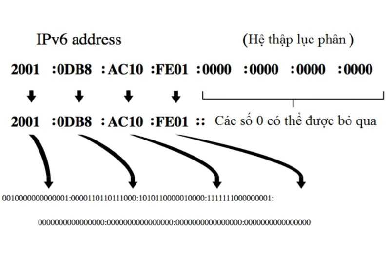
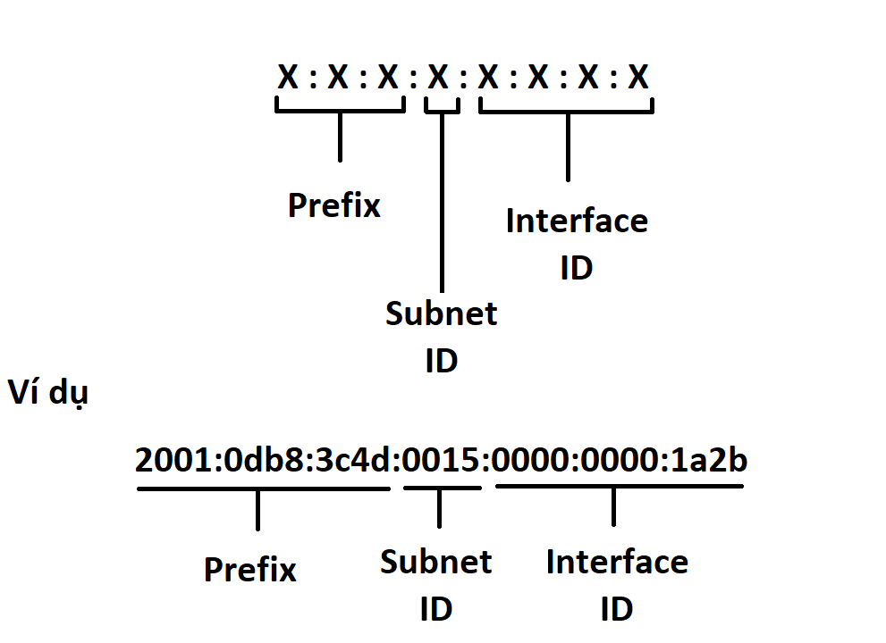

# 1. IPv6 là gì 
IPv6 ( Internet Protocal version 6 ) là phiên bản mới nhất của giao thức Internet(IP), giao thức truyền thông cung cấp một hệ thống định vị vị trí cho các máy tính trên mạng và định tuyến lưu lượng trên internet. 

# 2. Cấu trúc - thành phần IPv6
## 2.1 Cấu trúc IPv6
Một IPv6 có cấu trúc gồm 128 bit, và phân thành 8 nhóm . Mỗi nhóm gồm 16 bit ,mỗi nhóm được biểu diễn bằng 4 số hexa giữa các nhóm có sự phân chia bởi dấu ":"  
Ví dụ một địa chỉ IPv6 được biểu diễn theo cấu trúc sau :  
FEDC:BA98:768A:0C98:FEBA:CB87:7678:1111  
 
Những địa chỉ này lớn , khả năng cung cấp địa chỉ cho nhiều node và cung cấp cấu trúc phân cấp linh hoạt , nhưng nó không dễ viết ra .Vì thế có 1 số nguyên tắc nhằm rút ngắn lại cách biểu diễn 1 địa chỉ IPv6 
- Cho phép bỏ các số 0 nằm trước mỗi octet
- Thay bằng số 0 với nhóm toàn số 0
- Thay bằng dấu "::" cho các nhóm liên tiếp toàn số 0

Ví dụ : 1080:0000:0000:0070:0000:0989:CB45:345F sẽ được rút gọn là 
1080::70:0:989:CB45:345F hoặc 1080:0:0:70::989: CB45:345F

## 2.2 Thành phần IPv6
Một địa chỉ IPv6 được chia thành 3 phần: site prefix, subnet ID, interface ID.

Site prefix: là số được gán đến website bằng một ISP. Theo đó, tất cả máy tính trong cùng một vị trí sẽ được chia sẻ cùng một site prefix. Site prefix hướng tới dùng chung khi nó nhận ra mạng của bạn và cho phép mạng có khả năng truy cập từ Internet.
Subnet ID: là thành phần ở bên trong trang web, được sử dụng với chức năng miêu tả cấu trúc trang của mạng. Một IPv6 subnet có cấu trúc tương đương với một nhánh mạng đơn như subnet của IPv4.
Interface ID: có cấu trúc tương tự ID trong IPv4. Số này nhận dạng duy nhất một host riêng trong mạng. Interface ID (thứ mà đôi khi được cho như là một thẻ) được cấu hình tự động điển hình dựa vào địa chỉ MAC của giao diện mạng. ID giao diện có thể được cấu hình bằng định dạng EUI-64.

