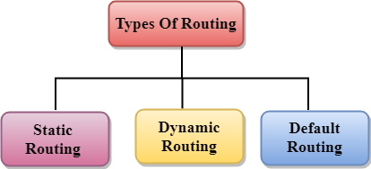

# 1. Routing là gì ?
## 1.1 Định nghĩa 
Định tuyến hay routing là quá trình lựa chọn đường đi trong bất kỳ mạng nào. Một mạng máy tính được tạo thành từ nhiều máy, được gọi là các node, và các đường dẫn hoặc đường đi kết nối các node đó. Giao tiếp giữa hai node trong một mạng có thể thông qua nhiều con đường khác nhau
Bộ routing là một quá trình chọn đường dẫn mà dữ liệu có thể được truyền từ nguồn đến đích. routing được thực hiện bởi một thiết bị đặc biệt được gọi là bộ routing(Router).

Bộ routing hoạt động ở lớp mạng trong mô hình OSI và lớp internet trong mô hình TCP / IP
Bộ routing là một thiết bị mạng chuyển tiếp gói tin dựa trên thông tin có sẵn trong tiêu đề gói và bảng chuyển tiếp.

Các thuật toán routing được sử dụng để routing các gói tin. Thuật toán routing không là gì khác ngoài một phần mềm chịu trách nhiệm quyết định con đường tối ưu mà gói tin có thể được truyền đi.

Các giao thức routing sử dụng số liệu để xác định đường dẫn tốt nhất cho việc phân phối gói. Số liệu là tiêu chuẩn đo lường như đếm bước nhảy, băng thông, độ trễ, tải hiện tại trên đường dẫn, v.v. được sử dụng bởi thuật toán routing để xác định đường dẫn tối ưu đến đích.

## 1.2 Chỉ số và các giá trị routing
Các chỉ số và chi phí routing được sử dụng để xác routing đường tốt nhất đến điểm đến. Các yếu tố được sử dụng bởi các giao thức để xác định đường đi ngắn nhất, những yếu tố này được gọi là một thước đo.

Chỉ số là các biến mạng được sử dụng để xác định đường đi tốt nhất đến đích. Đối với một số giao thức sử dụng số liệu tĩnh có nghĩa là giá trị của chúng không thể thay đổi được và đối với một số giao thức routing khác, sử dụng số liệu động nghĩa là giá trị của chúng có thể được chỉ định bởi quản trị viên hệ thống.

***Các giá trị chỉ số phổ biến nhất được đưa ra dưới đây:***

**Hop count**: Hop count được định nghĩa là một số liệu chỉ định số lần truyền qua các thiết bị kết nối internet như bộ routing, một gói tin phải di chuyển trong một lộ trình để di chuyển từ nguồn đến đích. Nếu giao thức routing coi bước nhảy như một giá trị số liệu chính, thì đường dẫn có số bước nhảy ít nhất sẽ được coi là đường dẫn tốt nhất để di chuyển từ nguồn đến đích.  

**Độ trễ**: Là khoảng thời gian do bộ routing thực hiện để xử lý, xếp hàng và truyền một gói dữ liệu tới một giao diện. Các giao thức sử dụng số liệu này để xác định giá trị độ trễ cho tất cả các liên kết dọc theo đường dẫn end-to-end. Đường dẫn có giá trị trễ thấp nhất sẽ được coi là đường dẫn tốt nhất.
  

**Băng thông**: Dung lượng của liên kết được gọi là băng thông của liên kết. Băng thông được đo bằng bit trên giây. Liên kết có tốc độ truyền cao hơn như gigabit được ưu tiên hơn liên kết có dung lượng thấp hơn như 56 kb. Giao thức sẽ xác định dung lượng băng thông cho tất cả các liên kết dọc theo đường dẫn và băng thông tổng thể cao hơn sẽ được coi là đường tốt nhất.   

**Tải**: Tải cho biết mức độ mà tài nguyên mạng như bộ routing hoặc liên kết mạng đang bận. Một tải có thể được tính theo nhiều cách khác nhau như sử dụng CPU, các gói được xử lý mỗi giây. Nếu lưu lượng truy cập tăng, thì giá trị tải cũng sẽ được tăng lên. Giá trị tải thay đổi theo sự thay đổi trong lưu lượng.   

**Độ tin cậy**: Độ tin cậy là một yếu tố thước đo có thể bao gồm một giá trị cố định. Nó phụ thuộc vào các liên kết mạng và giá trị của nó được đo động. Một số mạng gặp sự cố thường xuyên hơn những mạng khác. Sau khi lỗi mạng, một số liên kết mạng được sửa chữa dễ dàng hơn các liên kết mạng khác. Bất kỳ hệ số độ tin cậy nào cũng có thể được xem xét để chỉ định xếp hạng độ tin cậy, thường là các giá trị số được chỉ định bởi người quản trị hệ thống.

# 2. Các loại routing 
*Routing có thể được phân thành ba loại:*

- Routing tĩnh
- Routing mặc định
- Routing động

    

**Routing tĩnh**
Routing tĩnh còn được gọi là routing không theo kiểu routing.
Đó là một kỹ thuật trong đó người quản trị thêm các tuyến đường trong bảng routing theo cách thủ công. Bộ routing có thể gửi các gói tin đến đích dọc theo tuyến đường do quản trị viên xác định. Trong kỹ thuật này, các quyết định routing không được thực hiện dựa trên điều kiện hoặc cấu trúc liên kết của mạng
*Ưu điểm của routing tĩnh*

- Không có chi phí: Nó có chi phí cho việc sử dụng CPU của bộ routing. Do đó, bộ routing rẻ hơn có thể được sử dụng để routing tĩnh.
- Băng thông: Nó không sử dụng băng thông giữa các bộ routing.
- Bảo mật: Nó cung cấp bảo mật vì người quản trị hệ thống chỉ được phép có quyền kiểm soát việc routing đến một mạng cụ thể.

*Nhược điểm của routing tĩnh:*

- Đối với một mạng lớn, việc thêm từng tuyến theo cách thủ công vào bảng routing sẽ trở thành một nhiệm vụ rất khó khăn.
- Người quản trị hệ thống nên có kiến ​​thức tốt về cấu trúc liên kết vì anh ta phải thêm từng tuyến theo cách thủ công.

**Routing mặc định**

- Routing mặc định là một kỹ thuật trong đó một bộ routing được cấu hình để gửi tất cả các gói đến cùng một thiết bị hop và không quan trọng nó có thuộc một mạng cụ thể hay không. Gói được truyền tới thiết bị mà nó được cấu hình trong 
  
- Routing mặc định. Routing mặc định được sử dụng khi mạng xử lý một điểm thoát duy nhất.
- Nó cũng hữu ích khi phần lớn các mạng truyền tải phải truyền dữ liệu đến cùng một thiết bị hp.

- Khi một tuyến đường cụ thể được đề cập trong bảng routing, bộ routing sẽ chọn tuyến đường cụ thể hơn là tuyến đường mặc định. Tuyến đường mặc định chỉ được chọn khi một tuyến đường cụ thể không được đề cập trong bảng routing.

**Routing động**

- Nó còn được gọi là routing thích ứng.
- Đây là một kỹ thuật trong đó một bộ routing thêm một tuyến mới trong bảng routing cho mỗi gói để đáp ứng với những thay đổi trong điều kiện hoặc cấu trúc liên kết của mạng.
- Các giao thức động được sử dụng để khám phá các tuyến đường mới để đến đích.
- Trong routing động, RIP và OSPF là các giao thức được sử dụng để khám phá các tuyến mới.
- Nếu bất kỳ tuyến đường nào đi xuống, thì điều chỉnh tự động sẽ được thực hiện để đến đích.

***Giao thức động phải có các tính năng sau:***

- Tất cả các bộ routing phải có cùng một giao thức routing động để trao đổi các tuyến.
- Nếu bộ routing phát hiện ra bất kỳ thay đổi nào trong điều kiện hoặc cấu trúc liên kết, thì bộ routing sẽ phát thông tin này đến tất cả các bộ routing khác.

*Ưu điểm của routing động:*
- Nó dễ dàng hơn để cấu hình.
- Sẽ hiệu quả hơn trong việc lựa chọn tuyến đường tốt nhất để đáp ứng với những thay đổi trong điều kiện hoặc cấu trúc liên kết.
*Nhược điểm của routing động:*

- Nó đắt hơn về việc sử dụng CPU và băng thông.
- Nó kém an toàn hơn so với routing mặc định và tĩnh.

*Tài liệu tham khảo*
[1] [https://websitehcm.com/routing-la-gi-cac-loai-routing/](https://websitehcm.com/routing-la-gi-cac-loai-routing/)
